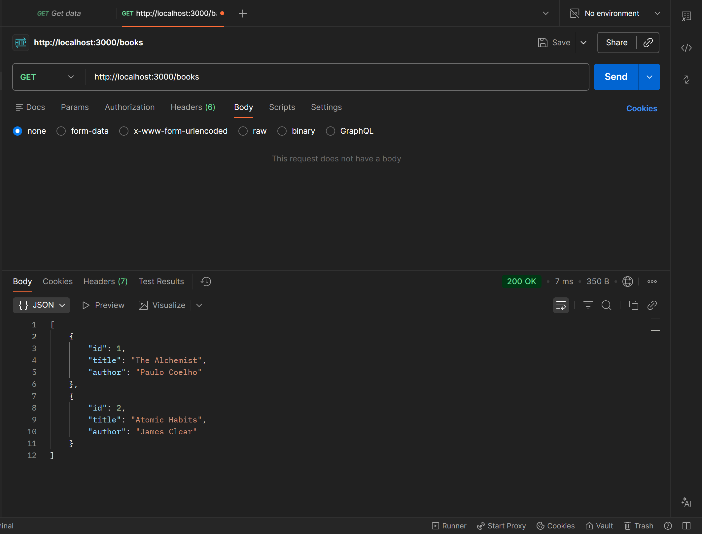
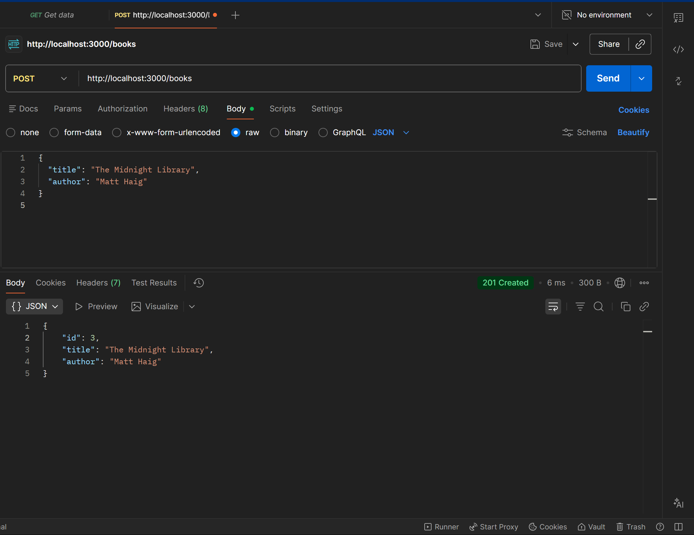
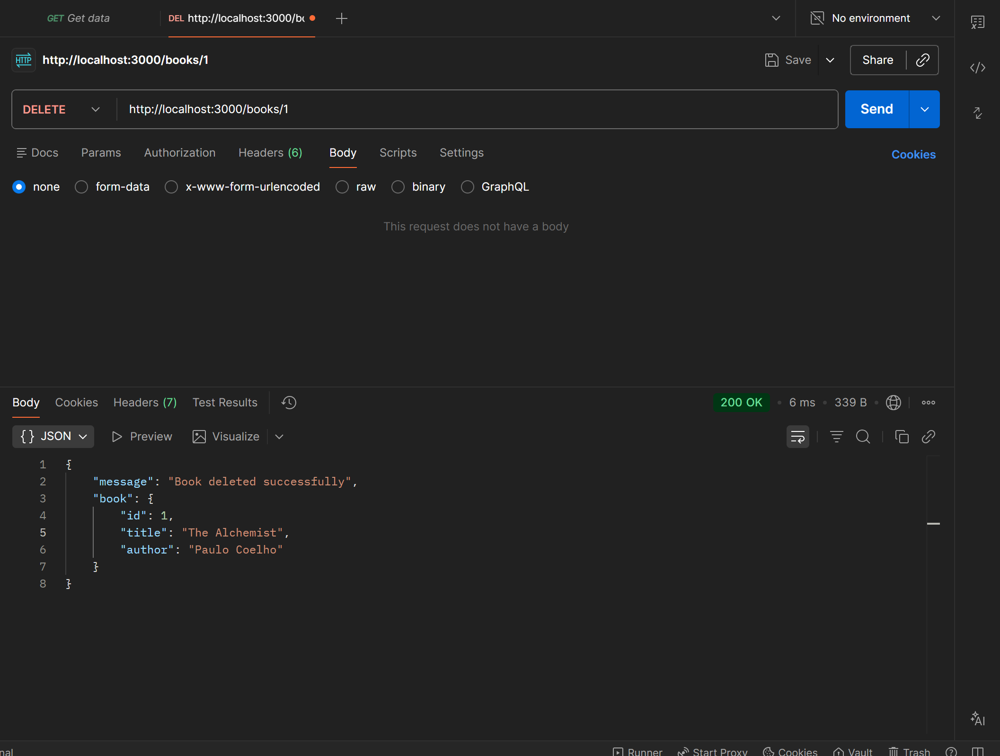

# Task-3

 Create a REST API to Manage a List of Books Using Node.js and Express. :-

# Book Management REST API

## Description
This project is a simple REST API built using Node.js and Express to manage a list of books. The data is stored in memory (no database used).

## Technologies Used
- Node.js
- Express.js
- Postman (for testing)

## How to Run the Project

1. Install dependencies:
   npm install

2. Start the server:
   node server.js

3. Open in browser:
   http://localhost:3000/books

## API Endpoints

GET /books  
Returns all books.

POST /books  
Adds a new book.  
Example JSON:
{
  "title": "Book Name",
  "author": "Author Name"
}

PUT /books/:id  
Updates a book by ID.

DELETE /books/:id  
Deletes a book by ID.

## Outcome
This project demonstrates understanding of REST API basics, Express routing, HTTP methods, and JSON handling.

## Screenshots

### GET Request

### POST Request

### PUT Request

### DELETE Request

